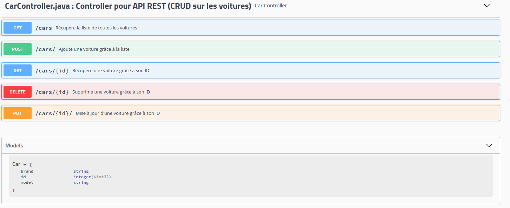

# Java Spring Microcars (module Java Avancé)

Application qui permet l’affichage d’une liste et l'ajout d'une nouvelle voiture à la liste de modèles de voitures.


*Fig.1 · Documentation de l'API Rest réalisée avec Swagger*

# Les Microservices

### 1 · Définition générale

Les microservices désignent une approche architecturale du développement d'applications. Une architecture de
microservices se différencie d'une approche monolithique classique par le fait qu'elle décompose une application pour en
isoler les fonctions clés. Chacune de ces fonctions est appelée « service » et ces services peuvent être développés et
déployés indépendamment les uns des autres. Ainsi, chacun peut fonctionner (ou dysfonctionner) sans affecter les autres.

# Glossaire SpringBoot Framework

```java
@Auteur :Matthieu Labaune
@Date de création:07-12-2020
@Date de mise à jour:08-12-2020
```

### Ressources

[Cheat Sheet RebelLabs](https://www.jrebel.com/system/files/spring-annotations-cheat-sheet.pdf)

## 1 · Annotations générales

### 1.1 · @EnableAutoConfiguration

L'annotation ***```@EnableAutoConfiguration```*** fait deviner à Spring la configuration basée sur les fichiers JAR
disponibles sur le classpath. Il peut savoir quelles bibliothèques vous utilisez et préconfigurer leurs composants sans
que vous ayez à lever le petit doigt.

### 1.2 · @Autowired

Pour relier les parties de l'application entre elles, utilisez le ***```@Autowired```*** sur les champs, les
constructeurs ou les méthodes d'un composant. ***```@Autowired```***.

##### Exemple

```java 
    @Autowired
    private CarDao carDao;
```

### 1.3 · @Repository

***```@Repository```*** est une annotation qui indique que la classe associée est un dépôt. Un dépôt est un mécanisme
d'encapsulation du stockage, de la récupération et du comportement de recherche qui émule une collection d'objets.

## 2 · Annotations Web

### 2.1 · @Controller

***```@Controller```*** marque la classe comme un contrôleur web, capable de traiter les requêtes HTTP. Spring examinera
les méthodes de la classe marquée par l'annotation ***```@Controller```*** et établira la table de routage pour savoir
quelles méthodes servent quels points terminaux.

##### Exemple

```java

@Controller
public class MainController {
    // Méthodes du controller
    //...
}
```

### 2.2 · @ResponseBody

Le ***```@ResponseBody```*** est une annotation qui fait que Spring lie la valeur de retour d'une méthode au corps de
réponse HTTP. Lors de la construction d'un terminal JSON, c'est une façon étonnante de convertir magiquement vos objets
en JSON pour une utilisation plus facile.

### 2.3 · @RestController

L'annotation ***```@RestController```*** une syntaxe de commodité pour @Controller et @ResponseBody ensemble. Cela
signifie que toutes les méthodes d'action dans la classe marquée retourneront la réponse JSON.

##### Exemple

```java

@RestController
public class CarController {
    // Méthodes du controller
    //...
}
```

### 2.4 · @RequestMapping

L'annotation ***```@RequestMapping(method = RequestMethod.GET, value = "/path")```*** spécifie une méthode dans le
contrôleur qui devrait être responsable de servir la requête HTTP vers le chemin donné. Spring travaillera sur les
détails de la mise en œuvre de cette méthode. Il vous suffit de spécifier la valeur du chemin sur l'annotation et Spring
acheminera les requêtes vers les méthodes d'action correctes.

##### Exemple

```java
@RequestMapping(value = {"/carList"}, method = RequestMethod.GET)
//Puis une méthode (ici carList qui retourne une liste de voitures)
public String carList(Model model){
        model.addAttribute("cars",cars);
        return"carList";
        }
```

### 2.5 · @RequestParam

Bien entendu, les méthodes de traitement des demandes peuvent être paramétrées. Pour vous aider à lier les paramètres
HTTP dans les arguments des méthodes d'action, vous pouvez utiliser
l'annotation ***```@RequestParam(value="name", defaultValue="World")```***. Spring analysera les paramètres de la
requête et mettra les paramètres appropriés dans les arguments de votre méthode.

### 2.6 · @PathVariable

Une autre façon courante de fournir des informations au backend est de les coder dans l'URL. Vous pouvez ensuite
utiliser l'annotation ***```@PathVariable("placeholderName")```*** pour amener les valeurs de l'URL aux arguments de la
méthode.

##### Exemple

```java
// Ici, on passe l'id (int) comme information via l'url via la méthode showCar
public Car showCar(@PathVariable int id){
        Car car=new Car(id,"Honda","Jazz");
        return car;
        }
```

### 2.7 · CRUD Annotations

Pour construire un CRUD on peut utiliser les annotations correspondant aux requêtes HTTP, à savoir :

1. GET : @GetMapping(value = "cars"),
2. POST : @PostMapping(value = "cars/store"),
3. PUT : @PutMapping(value = "/cars/{id}/update"),
4. DELETE : @DeleteMapping (value = "/cars/{id}/destroy").

## 3 · JPA et MariaDB

### 3.1 · Configuration générale

La Java Persistence API repose essentiellement sur l'utilisation des annotations, comme pour SpringBoot. Elles
permettent de définir facilement des objets métier, qui pourront servir d'interface entre la base de données et l'
application, dans le cadre d'un mapping objet-relationnel. Pour pouvoir utiliser l'interface JPA (*Java Persistence
API*), il faut importer le package correspondant avec Maven dans le pom.xml. Il faut également ajouter une dépendance
pour le type de Système de DB utilisé. Ici on utilise MariaDB par facilité car déjà installé.

```java
<dependency>
<groupId>org.springframework.boot</groupId>
<artifactId>spring-boot-starter-data-jpa</artifactId>
</dependency>

<dependency>
<groupId>org.mariadb.jdbc</groupId>
<artifactId>mariadb-java-client</artifactId>
</dependency>
```

Ensuite, il faut configurer cela dans l'application (dans *application.properties*).

```java
#DATABASE CONFIGURATION
        spring.datasource.url=jdbc:mariadb://localhost:3306/VehiculeRentale
        spring.datasource.username=user
        spring.datasource.password=hardtofind
        spring.datasource.driver-class-name=org.mariadb.jdbc.Driver
        spring.jpa.hibernate.ddl-auto=create-drop
```

On ajoute donc un nom pour la DB "*VehiculeRentale*". On renseigne l'utilisateur et le password pour accéder à notre DB.
On ajoute évidement le driver mariadb et on indique par *"create-drop"* que la base sera créée lors du lancement de
l'application et détruite lors de son arrêt.

### 3.2 · Annotations JPA

Comme pour SpringBoot, il existe différentes annotations pour JPA afin de pouvoir l'utiliser.

##### Exemple

```java
package com.ecars.microcars.model;

import javax.persistence.*;
import javax.xml.crypto.Data;
import java.text.SimpleDateFormat;
import java.util.Date;

@Entity 
public class Car {
    
    //ID
    @Id
    @GeneratedValue
    private int id;

    //TIMESTAMP
    @Temporal(TemporalType.TIMESTAMP)
    private Date createdAt;
}
```
#### 3.2.1 · @Entity
@Entity nous indique que cette classe est une classe persistante. Elle représente une table de la DB. 
Elle peut prendre un attribut name, qui fixe le nom de cette entité. Par défaut, le nom d'une entité est le nom complet de sa classe.
Les attributs de la classe sont donc les colonnes de la future table de la DB.

#### 3.2.2 · @Id
Associe un champ de la table à la propriété en tant que clé primaire.

#### 3.2.3 · @GeneratedValue
Demande la génération automatique de la clé primaire au besoin.

#### 3.2.5 · @Temporal

Pour préciser le type SQL temporel avec lequel on veut stocker ces champs, on dispose d'une annotation spécifique : @Temporal. Cette annotation prend un unique attribut, qui peut prendre les valeurs TemporalType.DATE, TemporalType.TIME ou TemporalType.TIMESTAMP.
   * TemporalType.DATE : enregistre les dates en temps que jour / mois / année ;
   * TemporalType.TIME : enregistre les dates en temps que heure / minute / seconde ;
   * TemporalType.TIMESTAMP : enregistre les deux informations de date et d'heure dans la jouenée.


